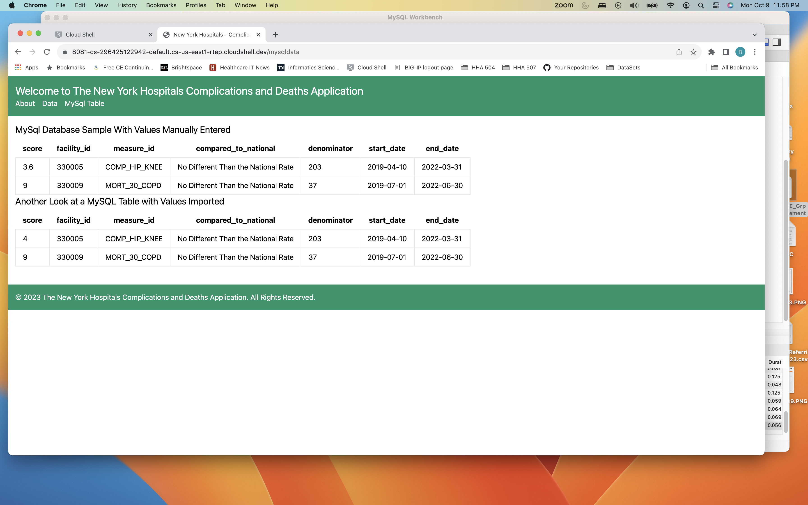
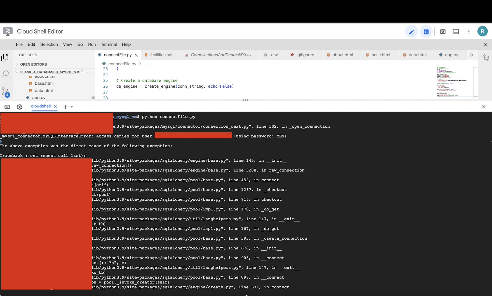
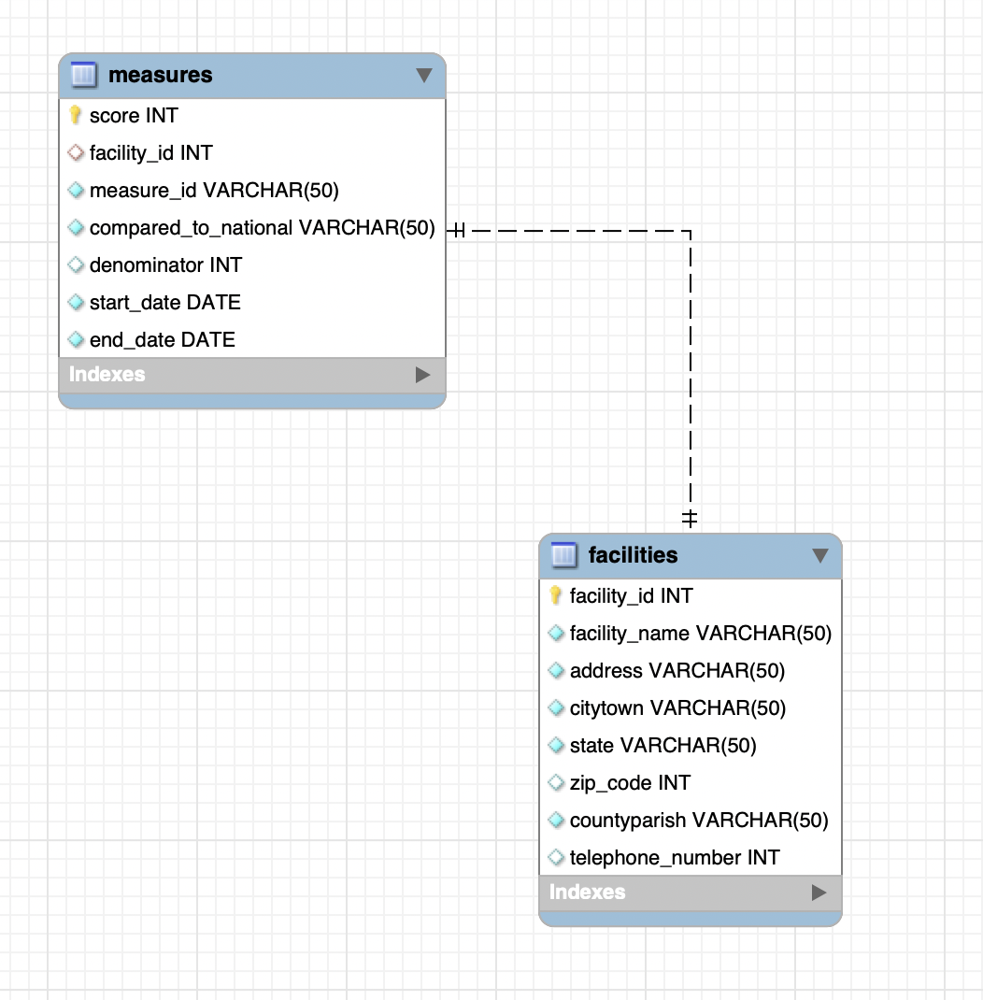

# HHA 504 Week 4b: MySQL on VMs with Azure and GCP

## Application and Errors
Locally deployed Flask application integrated with MySQL

### <b> Errors </b>

1. View screenshot above. The column 'score' is entered as an INT, but contains decimals. This resulted in the score for facility_id 330005 in the second table to be rounded to the next whole number. Tried to change the value in MySQL to Decimal but was not able to fix.

2. View screenshot below. Entered incorrect password in MySQL and the VM, so was unable to connect. Found the correct password and was able to proceed.

## Virtual Machine Setup
### Initial Azure Setup
1. Azure > Create Azure virtual machines
2. Select appropriate resource group
3. Change size to Standard_B1|s
4. Create username and apssword for admin account
5. Select all inbound ports
6. Select Standard HDD OS disk type and Yes to managed disks
7. Enable auto-shutdown with email notification and disable backup
8. Under Networking> Add inbound port rule to accept 3306
### Connect to Google Cloud Shell Platform
1. Log into VM by using ssh username@IP address
2. Update Ubuntu by using sudo apt-get update
3. Install mysql using sudo apt install mysql-server mysql-client
4. Log in using sudo mysql 
5. Create a new user using CREATE USER 'user'@'%' IDENTIFIED BY 'password'; 
6. Grant priviledges to new user by entering 'GRANT ALL PRIVILEGES ON *.* TO 'user'@'%' WITH GRANT OPTION;
7. Edit server configuration file by entering sudo nano /etc/mysql/mysql.conf.d/mysqld.cnf > Write Out
8. Change bind address to 0.0.0.0, then save and exit
9. Restart VM by entering /etc/init.d/mysql restart

## MySQL setup
1. Open MySQL and create new connections for Azure VM 
2. Enter the hostname, username and passwords for Azure VM
3. Test connections to ensure the link

## Database Schema
There are two tables named 'measures' and 'facilities', with the foreign key as facility_id, and a 1:1 relationship. 

## Database Migration Process 
1. Create .env and .gitignore files in Google Cloud Shell Editor
2. In the .env file enter the host name, database name, database username, database password, database port and charset using the information from MySQL Workbench.
3. Create a database engine using create_engine
4. Get list of tables using get_tables
5. Run sql query and return as a dataframe using execute_query_to_dataframe
6. Store the value from 'SELECT * FROM table name' into a variable
